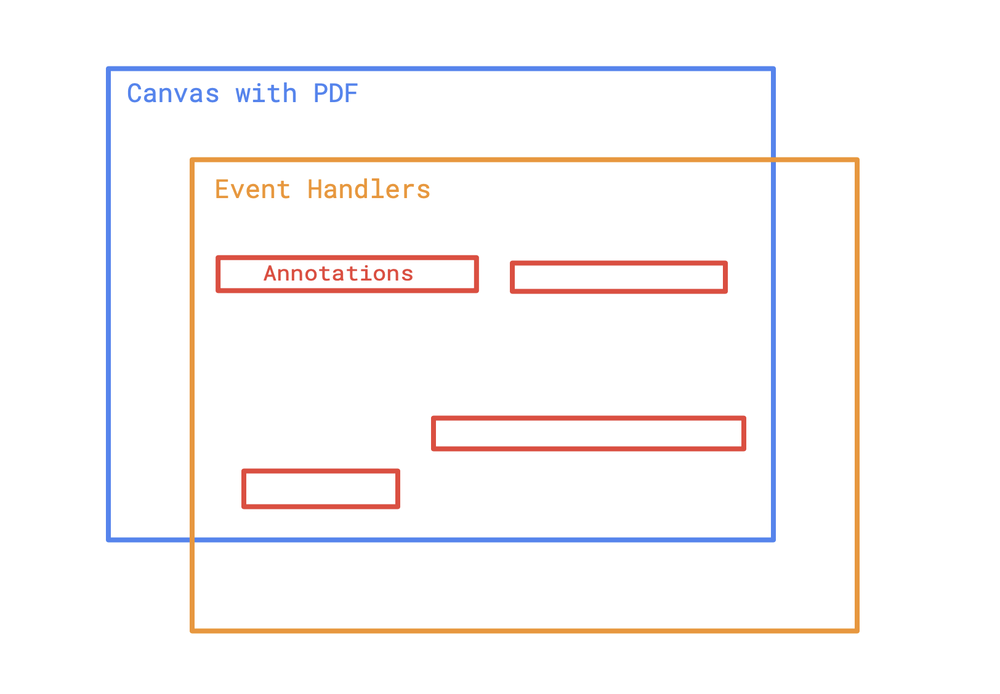

# Code Walkthrough

In this document, we provide a higher-level guide to the structure of the code in this program. It is meant to be accessible for anyone with a background in React and a guide for other developers who need to build annotation systems for separate projects.

## PDF and the Canvas

Our central technique involves rendering the PDF document onto a `canvas` with `position: absolute` and putting a sequence of `div`s on top of it. These `div`s have event handlers that register user interactions and handle the business-logic. A visual representation is as follows:

  </img>

## Annotations

## Labels/Groups

## Slider
